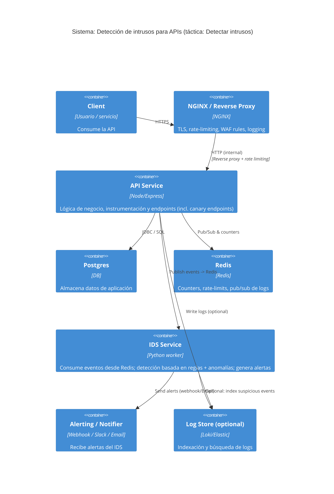

# REPORT.md — Seguridad de APIs: Táctica «Detectar intrusos"

**Autor:** (tu nombre)
**Tema:** Seguridad de APIs — Atributo de calidad: Seguridad
**Táctica:** Detectar intrusos (honeypots / canary tokens + análisis de telemetría + detección de anomalías + respuestas automatizadas)

---

## Resumen (abstract)

Este documento presenta el desarrollo conceptual, consideraciones técnicas y una demo práctica de una táctica defensiva para **detectar intrusos** dirigida a APIs. La solución combina instrumentación, deception (canary tokens), reglas heurísticas y un IDS ligero que consume telemetría para detectar actividad maliciosa. Incluye un sistema dockerizado mínimo (API, NGINX, Redis, Postgres, IDS) y las instrucciones para levantarlo y probarlo.

---

## 1. Contexto y objetivo

Las APIs son vectores primarios de interacción en arquitecturas modernas (microservicios, B2B, mobile backends). Detectar intrusos se refiere a la capacidad de identificar patrones de ataque, sondeo y abuso en la capa API antes de que provoquen pérdida de datos o escalada. Esta táctica no sustituye la defensa preventiva (autenticación, autorización, validación), sino que la complementa ofreciendo detección temprana y telemetría para respuesta.

**Objetivos concretos:**

* Detectar sondeos automatizados y fuzzing.
* Identificar uso de credenciales robadas o keys comprometidas.
* Señalar accesos a artefactos de deception (canary tokens).
* Proveer canales de alerta para respuesta automática/operativa.

---

## 2. Desarrollo conceptual (independiente de proveedor)

### Componentes conceptuales

1. **Instrumentación y telemetría:** logs estructurados (JSON), trazas y métricas (latencia, tasa de errores). Registrar: timestamp, path, método, headers relevantes (X-Forwarded-For, X-Real-IP, X-API-Key), user-agent, response_code, latency.

2. **Deception / Canary tokens:** Exponer rutas, headers o claves que no deberían ser usados por clientes legítimos (ej. `/api/v1/.canary/FLAG_...` o header `X-Canary-Token`). El acceso a estos recursos es una señal de compromiso o sondeo malicioso.

3. **Control en gateway/proxy:** NGINX / API Gateway para TLS, rate limiting, y WAF/rules primeras líneas.

4. **Motor de detección (IDS):** Servicio que consume eventos y aplica reglas simples (thresholds/rate), heurísticas (401 spikes, fuzz payload patterns), y módulos estadísticos/ML (baseline por cliente). Producción puede integrar SIEM o stream processing (Kafka → Flink / Spark).

5. **Respuesta y orquestación:** bloqueo de IP/API key, creación de tickets, notificación a Slack/Email, o activación de mecanismos de deception más avanzados.

### Mecanismos de detección recomendados

* **Reglas deterministas:** rate limits, signatures, listas de IPs.
* **Deception hits:** canary token → alerta crítica inmediata.
* **Detección por anomalía:** baselines por cliente (requests/minuto, endpoints por sesión); disparar cuando z-score alto.
* **Correlación:** combinar señales con scoring para disminuir falsos positivos.

---

## 3. Consideraciones técnicas

### Diseño y aislamiento

* Aislar honeypots/canary endpoints en redes y permisos separados para que no permitan escalada desde el honeypot.
* No incluir PII en los recursos de deception.

### Componentes tecnológicos (demo-agnóstico)

* **Proxy/Gateway**: NGINX o Gateway Cloud (AWS API Gateway, Kong). Encargado de TLS, rate-limiting y logging.
* **API service**: cualquiere stack (Node, Python, Go) con logging JSON y publicación de eventos a un bus (Redis/Kafka).
* **Redis**: counters, pub/sub y short-term storage de eventos.
* **IDS service**: consumidor de eventos que aplica reglas y notifica.
* **Store / SIEM (opcional)**: ELK/Loki/Grafana para persistencia y análisis histórico.

### Métricas y SLI sugeridos

* MTTD (Mean Time to Detect)
* False Positive Rate
* Hits a canary tokens / mes
* Requests por segundo por API key y % bloqueos por rate-limit

### Riesgos

* Honeypots mal aislados pueden ser explotados.
* Modelos ML necesitan datos y tuning:

  * Riesgo de altos falsos positivos al inicio.
  * Privacidad de logs (PII) a manejar.

---

## 4. Arquitectura propuesta (resumen)

Cliente → NGINX (reverse proxy + rate-limit + logs) → API (instrumentado) → Postgres

API → publica eventos → Redis Pub/Sub → IDS worker → Alerting (Slack/Email)

Opcional: Logs a ELK / Loki para búsqueda y dashboards.

### Diagrama de contenedores (C4, Container view)

